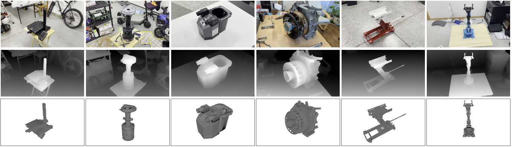

# Assembly Depth: A Large-Scale Dataset and Domain-Bridging Method for Industrial Assembly Recognition

[](https://drive.google.com/file/d/1SGhJRWMUXsqqx3eZQMGVWpFcCJCcfdl-/view?usp=drive_link)
&nbsp;&nbsp;
[](./README.md#dataset)
&nbsp;&nbsp;
[](./README.md#pre-trained-models)


> Our assembly recognition pipeline. Top row: random input RGB images from our dataset. Middle row: monocular depth estimates generated by Depth Anything V2, which serve as input to our recognition network. Bottom row: visualization of our recognition results, showing estimated pose and present parts by rendering the predicted assembly state.

---

This repository contains the official PyTorch implementation for the paper: **"Assembly Depth: A Large-Scale Dataset and Domain-Bridging Method for Industrial Assembly Recognition"** (CASE 2025).

We address two key challenges in industrial assembly recognition: the lack of a large-scale, real-world dataset and the domain gap between synthetic training data and real operating conditions.

Our contributions are:
1.  **A new large-scale dataset** of real industrial assemblies, comprising 90 scenes from 6 diverse pieces of equipment with over 700 parts.
2.  **A novel two-stage recognition approach** that uses monocular depth estimation as a preprocessing step to effectively bridge the synthetic-to-real domain gap, significantly improving 6D pose estimation and part classification performance.


## Installation

This codebase is tested with Python 3.8.

**1. Create a Virtual Environment:**
```bash
python -m venv venv
source venv/bin/activate
```

**2. Install PyTorch:**

Our code was developed with PyTorch 1.13.1. Please visit the PyTorch previous versions page to find the correct installation command for your specific system (CUDA version or CPU-only). This is a critical step.

For example, to install for CUDA 11.7, the command is:
```
# For CUDA 11.7
pip install torch==1.13.1+cu117 torchvision==0.14.1+cu117 torchaudio==0.13.1 --extra-index-url [https://download.pytorch.org/whl/cu117](https://download.pytorch.org/whl/cu117)
```
For a CPU-only setup:
```
# For CPU-only
pip install torch==1.13.1 torchvision==0.14.1 torchaudio==0.13.1
```
**3. Clone Repository and Install Dependencies:**

Once PyTorch is installed, clone this repository and install the remaining packages from requirements.txt.
```
git clone https://github.com/overlab-kevin/assembly_depth.git
cd assembly_depth
pip install -r requirements.txt
```

---

## Dataset

Our work introduces two datasets: a synthetic dataset for training and a real-world dataset for testing.

* **Synthetic Dataset (for Training/Validation):** Contains 300,000 training images across 6 equipment types.
* **Real Dataset (for Testing):** Contains 90 real-world scenes with ground truth poses and assembly states.

You can download both datasets from the following link:
* **Dataset Download:** `https://drive.google.com/drive/folders/1i8n_TsgpvK8vDi-kL99pTFVK2AAvqYrF?usp=drive_link`

---

## Pre-trained Models

We provide the pre-trained model weights used to achieve the results reported in our paper.

* **Weights Download:** `https://drive.google.com/drive/folders/1ReAyCMBqSp36MzH0EVhDyK7SWZf6_tbJ?usp=drive_link`

Download the weights and place them in a `weights/` directory in the project root, or specify the path directly when running evaluation. The training script will generate new weights in the `runs/` directory.

---

## Training

To train the model from scratch, run the `train.py` script with a configuration file and an experiment name.

1.  **Update the config file:** Open `configs/assembly_depth_config.yaml` and set the `DATASET.PATH` to your synthetic dataset location.

2.  **Run training:**
    ```bash
    python train.py configs/assembly_depth_config.yaml --name <your_experiment_name>
    ```
    * `--name`: A unique name for the training run. Checkpoints and logs will be saved to `runs/<your_experiment_name>/`.
    * Use `--resume` to continue training from the latest checkpoint in an existing experiment directory.

---

## Evaluation

To evaluate a trained model on the real-world test set, use the `test.py` script.

1.  **Run evaluation:**
    ```bash
    python test.py --experiment_dir runs/<your_experiment_name>/ --test_data_path /path/to/your/datasets/real_dataset/
    ```
    * `--experiment_dir`: Path to a completed training run. The script will use the `config.yaml` and `best.pth` files from this directory.
    * `--test_data_path`: Path to the root of the real-world test dataset.

The script will output the final evaluation metrics (MSD Pose Error and Mean Part Accuracy) to the console, reproducing the results from our paper.

---

## Citation

If you find our work useful in your research, please consider citing our paper:

```bibtex
@inproceedings{murray2025assembly,
  title={{Assembly Depth: A Large-Scale Dataset and Domain-Bridging Method for Industrial Assembly Recognition}},
  author={Murray, Kevin and Duric, Zoran},
  booktitle={IEEE International Conference on Automation Science and Engineering (CASE)},
  year={2025}
}
